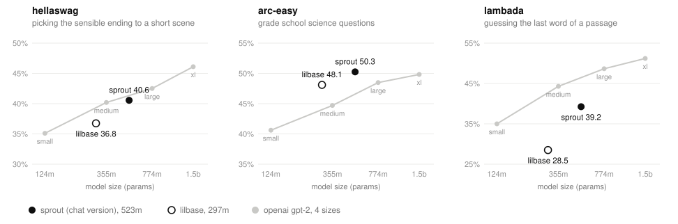

# sprout

a 523m param language model i trained from scratch on a free kaggle tpu, then finetuned into a chat model. it's the follow-up to [lilbase](https://github.com/navthings/lilbase): same recipe, about 1.8x the size and 2x the data.

## try it

```
ollama run navthings/sprout
```

or talk to it in your browser on [my site](https://navthings.github.io/playground/?model=sprout). it's a 345mb download and runs on your own computer. weights and ggufs are on [hugging face](https://huggingface.co/navthings/sprout).

it's small, so it makes stuff up with total confidence. it does know the capital of australia is canberra now, which lilchat didn't.

## how it did

<picture>
  <source media="(prefers-color-scheme: dark)" srcset="assets/vs_gpt2_dark.svg">
  
</picture>

every model gets the exact same few thousand questions, none of which it trained on, all scored by the same script on my macbook. a dot above the grey gpt-2 line beats a gpt-2 of the same size.

| model | params | hellaswag | arc-easy | lambada |
|---|---|---|---|---|
| gpt-2 small | 124m | 35.1% | 40.6% | 35.0% |
| lilbase | 297m | 36.8% | 48.1% | 28.5% |
| gpt-2 medium | 355m | 40.2% | 44.7% | 44.3% |
| **sprout (chat)** | **523m** | **40.6%** | **50.2%** | **39.2%** |
| gpt-2 large | 774m | 42.5% | 48.5% | 48.6% |
| gpt-2 xl | 1.5b | 46.1% | 49.8% | 51.2% |

on arc-easy (grade school science questions) sprout beats every gpt-2, even xl, which is three times its size. on hellaswag (pick the ending that makes sense for a short story) its level with gpt-2 medium. on lambada (guess the last word of a passage from a novel) gpt-2 wins clearly. my guess is the data: sprout mostly read educational web text, gpt-2 read pages linked from reddit, and lambada is all novels.

this is the chat version of sprout, since the base weights are still on kaggle, and chat finetuning usually costs a few points on tests like these. the script is [`eval/bench.py`](eval/bench.py).

## what it is

llama style: grouped query attention, rope, rmsnorm, swiglu, tied embeddings. 28 layers, 1280 wide, 20 query heads and 4 kv heads, 1024 token context, llama tokenizer (32k vocab).

it read 12 billion tokens from four sources:

| source | planned | what it actually read |
|---|---|---|
| fineweb-edu (sample-100BT) | 55% | 55% |
| dclm-baseline | 25% | 27% |
| cosmopedia-v2 | 10% | 9% |
| project gutenberg (english) | 10% | 9% |

books get cut into ~16,000 character chunks first so one novel can't take over a whole run of batches.

## training (`tpu/`)

- 22,888 steps of 524,288 tokens, data parallel over all 8 chips of a tpu v5e-8
- adamw with the optimizer state sharded across the chips, so each chip only holds 1/8 of it
- wsd learning rate: warm up to 3e-4 over 1500 steps, stay flat, then decay to 10% over the last 15%. unlike cosine, the total length can still change between sessions as long as the decay hasn't started
- about 130k tokens a second, so ~25.6 hours over 4 kaggle sessions. each session gets 8.4 hours, saves, and the next one picks up exactly where it stopped
- held-out loss at the end: 2.39 on fineweb-edu (perplexity 10.9), 2.72 on wikitext (perplexity 15.2)

to run it, open `tpu/sprout_tpu_kaggle.ipynb` on kaggle with a tpu v5e-8 and hit save & run all. how to resume is at the top of the notebook. mine is [here](https://www.kaggle.com/code/navneetdagdiya/lilbase2-tpu-kaggle).

## chat finetune

all of [smol-smoltalk](https://huggingface.co/datasets/HuggingFaceTB/smol-smoltalk), twice. 616m tokens in 4,702 steps of 131,072 tokens, learning rate 1e-4, about 90 minutes on the tpu. llama-2 `[INST]` format, with the loss only on the assistant replies. loss on chats it had never seen went from 1.61 to 0.955.

it ran in a separate kaggle notebook: [sprout-sft-tpu-kaggle](https://www.kaggle.com/code/navneetdagdiya/sprout-sft-tpu-kaggle).

## `sft/`, finetuning on a mac

the mlx script that made [lilchat](https://ollama.com/navthings/lilchat) (lilbase finetuned overnight on a 16gb macbook air). same idea as above, just slower.

```
cd sft
uv venv && uv pip install -r requirements.txt
python sft.py --hours 12       # works out the step count from measured speed
python chat.py                 # talk to it in the terminal
```

`--base` defaults to lilbase's hf folder (`../lilbase/mac/hf`). point it at any llama style hf folder with the same tokenizer.

## `eval/`

`bench.py` runs every model through lambada, hellaswag, arc-easy and two held-out reading tests, and saves `results.json` after each model so a crash doesn't lose anything. `readme_chart.py` makes the chart above from it.

## ambitions

the goals for sprout are to:

1. beat gpt2 extralarge (1.5b) or get close to it
2. finetune it to a competitive coding model for 500M
